# Enable Database Management for Oracle Database@Azure Cloud Databases

## Introduction

In this lab, you will go through the steps to set up Database Management for Oracle Database@Azure Databases.

Multicloud adoption allows businesses to harness the strengths of different cloud platforms while mitigating risks. However, monitoring and managing databases in a multicloud environment introduces unique challenges, requiring specialized approaches and solutions. You can use Diagnostics & Management features to monitor and manage Oracle Databases running on the following cloud platforms:


Estimated Time: 60 minutes

### Objectives

Set up Database Management to monitor and manage Oracle Database@Azure Cloud Databases.

Here are some of the important tasks you can perform using Diagnostics & Management features:
- Monitor the key performance and configuration metrics of your fleet of Oracle Databases. You can also compare and analyze database metrics over a selected period of time.
- Use Performance Hub for a single-pane-of-glass view of database performance, which enables you to quickly diagnose performance issues.
- Use AWR Explorer to visualize historical performance data from AWR snapshots in easy-to-interpret charts.
- Use the other available Diagnostics & Management features to monitor, manage, and administer a single Oracle Database.
- Use dashboards to visualize, explore and analyze database performance metrics.

## Prerequisites

Understand the Oracle Database@Azure compartment structure: 
Oracle Database@Azure Exadata Infrastructure is created in the auto-generated compartment with the name matches the Azure Subscription ID. 
    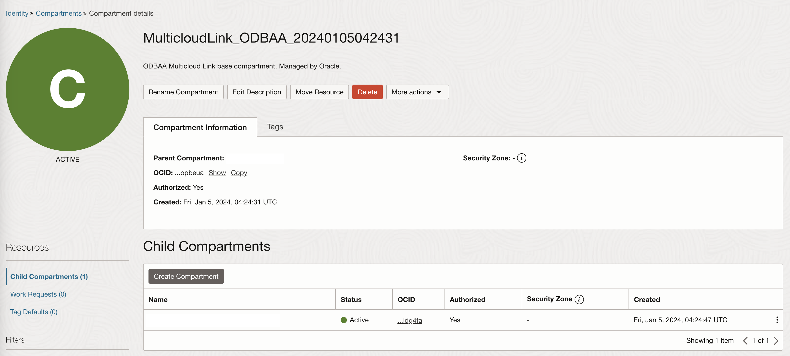
    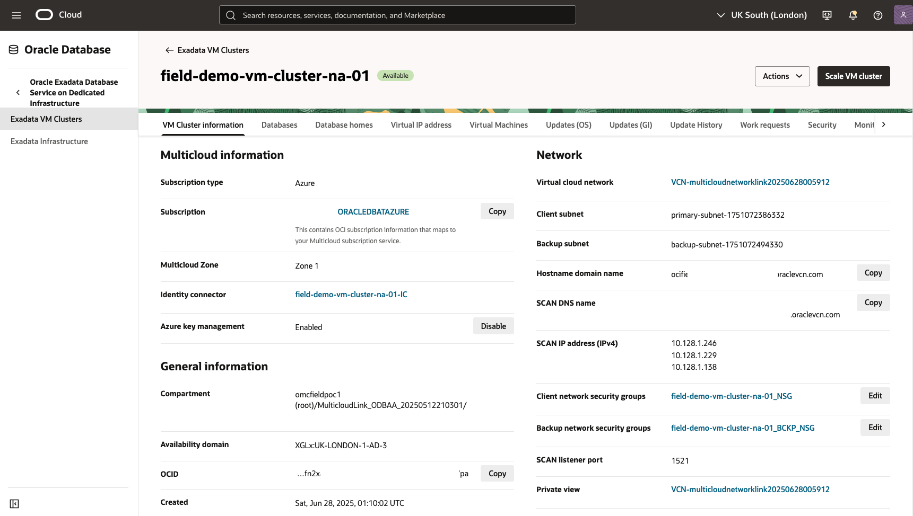

### Add Required IAM Policies

- From the **Oracle Cloud console navigation menu** located in the upper left, click **Identity & Security**. Under **Identity**, click **Policies**.
- Click **Create Policy**. In the **Create Policy** dialog :
- **Name**: Enter MulticloudLink\_ODBAA\_20240227\_DBM\_Policy
- **Description**: Enter Multicloud ODBAA Database Management Service Policy
- **Compartment**: Select root.
- Enable **Show manual editor**.
- Enter the following in **Policy Builder**:
- **Policy statements**

    ```
    <copy>
    Allow service dpd to read secret-family in compartment MulticloudLink_ODBAA_20240105042431
    Allow service dpd to manage objects in compartment MulticloudLink_ODBAA_20240105042431
    Allow group odaa_dbmgmt-group to manage dbmgmt-family in tenancy 
    Allow group odaa_dbmgmt-group to read database-family in tenancy 
    Allow group odaa_dbmgmt-group to manage vnics in tenancy 
    Allow group odaa_dbmgmt-group to use subnets in tenancy 
    Allow group odaa_dbmgmt-group to use network-security-groups in tenancy 
    Allow group odaa_dbmgmt-group to use security-lists in tenancy 
    Allow group odaa_dbmgmt-group to manage secret-family in compartment MulticloudLink_ODBAA_20240105042431 
    Allow group odaa_dbmgmt-group to read buckets in compartment MulticloudLink_ODBAA_20240105042431
    Allow group odaa_dbmgmt-group to read metrics in compartment MulticloudLink_ODBAA_20240105042431 
    Allow group odaa_dbmgmt-group to manage alarms in compartment MulticloudLink_ODBAA_20240105042431 
    Allow group odaa_dbmgmt-group to manage ons-topics in compartment MulticloudLink_ODBAA_20240105042431 
    Allow group odaa_dbmgmt-group to manage management-dashboard-family in compartment MulticloudLink_ODBAA_20240105042431 
    </copy>
    ```

## Task 1: Create Database Monitor User

Set database monitoring user credentials in the **Oracle Database@Azure**. You must grant a database user, for example, **DBSNMP**, the privileges required to monitor and manage the Oracle Database@Azure Databases.

    Connect to DBCS database as **SYSDBA** and execute the following :

    ```
    <copy>
    GRANT CREATE PROCEDURE TO dbsnmp;
    GRANT SELECT ANY DICTIONARY, SELECT_CATALOG_ROLE TO dbsnmp;
    GRANT ALTER SYSTEM TO dbsnmp;
    GRANT ADVISOR TO dbsnmp;
    GRANT EXECUTE ON DBMS_WORKLOAD_REPOSITORY TO dbsnmp;
    alter user dbsnmp account unlock;
    alter user dbsnmp identified by "<password>";
    </copy>
    ```

The database user password checks in Database Management require the password to be Federal Information Processing Standards (FIPS) compliant:

- Password length must be between 14 to 127 characters.
- Password must have at least one lowercase, one uppercase, one digit, and one special character.

## Task 2: Create OCI Vault and Secret to Store Database Monitoring User Credentials

- From the Oracle Cloud Console **Navigation Menu** located in the upper left, click Identity & Security and click Vault.
- On the **OCI Vaults** page, click **Create Vault**.
- Create in **Compartment**: Select the name of compartment.
- **Name**: Enter OnM_vault.
- Click **Create Vault**.

     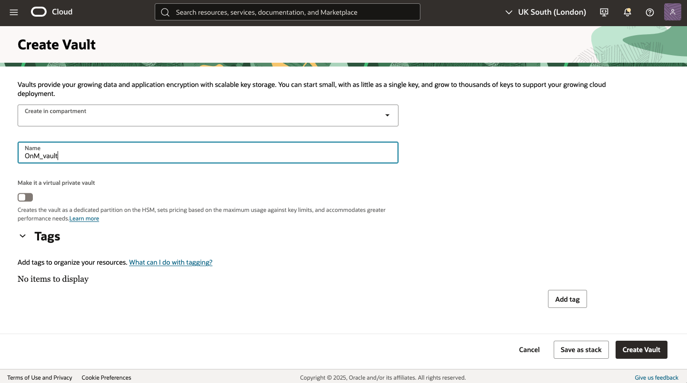
     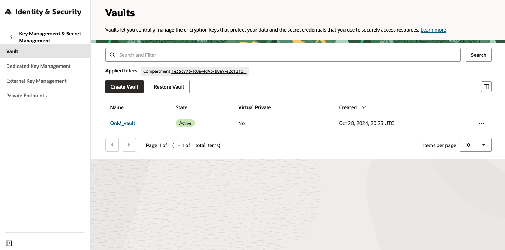

- Click the vault **OnM_vault**
- On the Vault Details page, click **Create Key**. 
- On the **Create Key** page, select all the defaults
- Enter **Name** : **OnM_key**.

     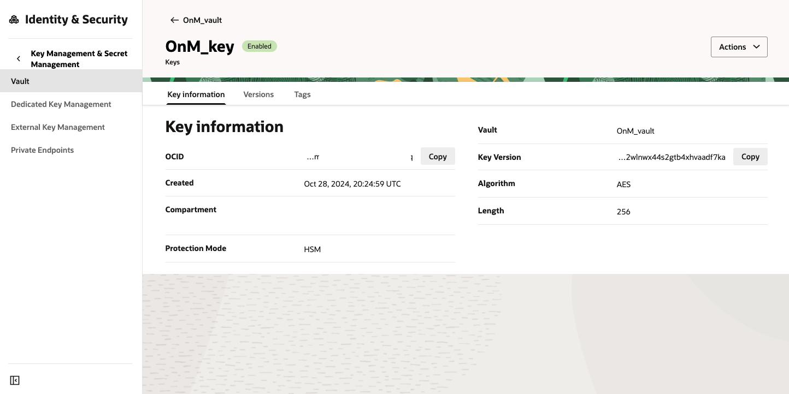

* On the **Vault Details** page, confirm the State of key is Enabled. 
* In the left pane, click **Secrets**.

Click Create **Secret**. On the **Create Secret** page, enter the following :

* **Compartment**: Select Compartment Name
* **Name**: <dbname\>_secret
* **Description**: Monitoring user password
* **Encryption Key**: Select OnM_key
* **Select Manual secret generation**
* **Secret Contents**: Enter the DBSNMP user password
* Click **Create Secret**.

    Confirm the Status of <dbname\>_secret is Active.
    
     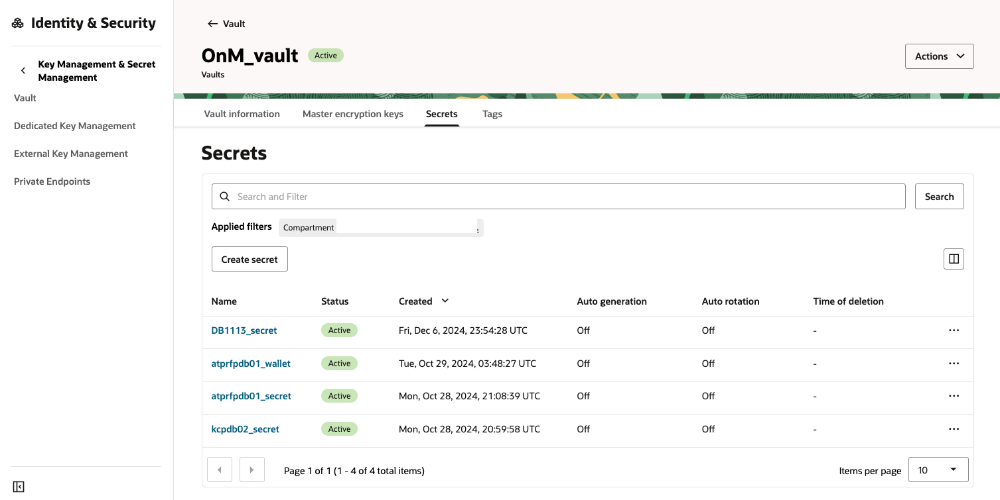


## Task 3: Create a Database Management Private Endpoint

- **Database Management Private Endpoint** is required to enable communication between Database Management and your Oracle Database@Azure in a Virtual Cloud Network (VCN). 
- Private endpoints are needed to connect to Oracle Database@Azure running in a private VCN.
- **Database Management Private Endpoint** is its network point of presence in the Oracle Database@Azure’s VCN. 
- The private endpoint need not be on the same subnet as the Oracle Database@Azure, although, it must be on a subnet that can communicate with the Oracle Database@Azure.
- Private End point must be on a subnet in the customer VCN that can communicate with the Oracle Cloud Database

Refer Create a Database Management Private Endpoint for best practices.

- Go to **Navigation menu**, click **Observability & Management**. Under **Database Management**, click **Administration**.
- On the left pane on the **Administration** page, click **Private Endpoint** and select the compartment in which you want to create the private endpoint.
- On the **Private Endpoints** page, click **Create Private Endpoint**.
- In the **Create Private Endpoint** dialog:
- **Name**: Enter DBM_PE.
- **Description**: Enter Database Management Private Endpoint.
- **Choose Compartment**: Select the compartment in which you want the private endpoint to reside.
- **Use this private endpoint for RAC databases**: Select this check box if you want to create a Database Management private endpoint for Oracle Database@Azures RAC databases.
- **Virtual Cloud Network**: Select the VCN in which the Oracle Database@Azure can be accessed.
- **Subnet**: Select a subnet within the selected VCN.
- **Network Security Group**: Optionally, select an NSG
- Click **Create Private Endpoint**.

## Task 4: (Optional) Add Security Rules to enable communications

- Add ingress and egress security rules to Security Lists or Network Security Groups (NSGs)
- You must have the required permissions to add the ingress and egress rules to Security Lists or Network Security Groups (NSGs)
- For databases running on RAC and Exadata Cloud Service, use SCAN IP for communicating with Database Management service
    
     

- Add stateful security rules to a Security List to enable communication between a Database Management private endpoint and Oracle Database@Azure in the same subnet in the VCN.
- Ingress rule for the Oracle Database@Azure's VCN: The Oracle Database@Azure's VCN (on port 1521) can receive incoming traffic from the Database Management private IP address from any port.
    
     

- Egress rule for the Database Management private endpoint: The Database Management private IP address (from any port) can send requests to the Oracle Database@Azure's VCN on port 1521.
    
     

## Task 5: Enable Database Management Service for Oracle Database@Azure Databases

- Navigate to the **Oracle Database@Azure Exadata VM Cluster Details** page
- Click the related Database to enable the **Database Management Service**
- On the **Database details** page, find **Associated services** section and click **Enable for Database Management**.

     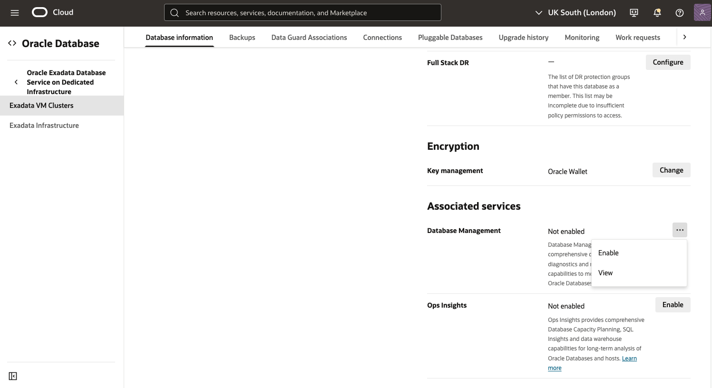

After the Enable Database Management page is redirected and fully loaded, verify the following database information on the page. 
- VM cluster 
- Database home
- Database name
- Service name
- Protocol
- Port

    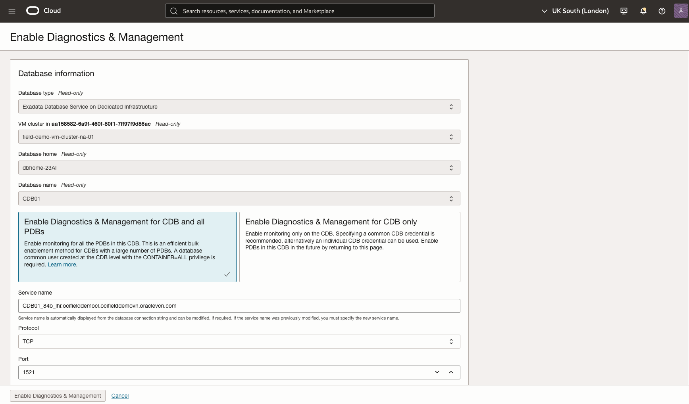

Provide the credentials for the database connection
- **Database username**: Enter dbsnmp
- **User password secret**: Select the secret from the drop down menu
- Click **Add policy** to create the policy for Database Management service to read the secret. 
- Select **Connection Mode**: select Private Endpoint from the drop-down menu
- Select **Management options**: select Full management
- Click **Enable Database Management**
    
    

## Task 6: Check Monioring metrics for Oracle Database@Azure Exadata VM Cluster and the Databases in OCI Console and Azure Portal

### Check Oracle Database@Azure Monioring metrics in OCI Console
- Navigate to the **Oracle Database@Azure Exadata VM Cluster Details** page
- Click the **Monitoring** tab
- Click the **Metrics** link, you can see the metrics for the Exadata VM Cluster metrics under **oci\_database\_cluster** metric namespace.


     

- Navigate to the **Databases** tag, click the database you want to monitor the metrics
- Click the **Monitoring** tab, you can see the metrics for the database metrics under **oci\_database** metric namespace.


     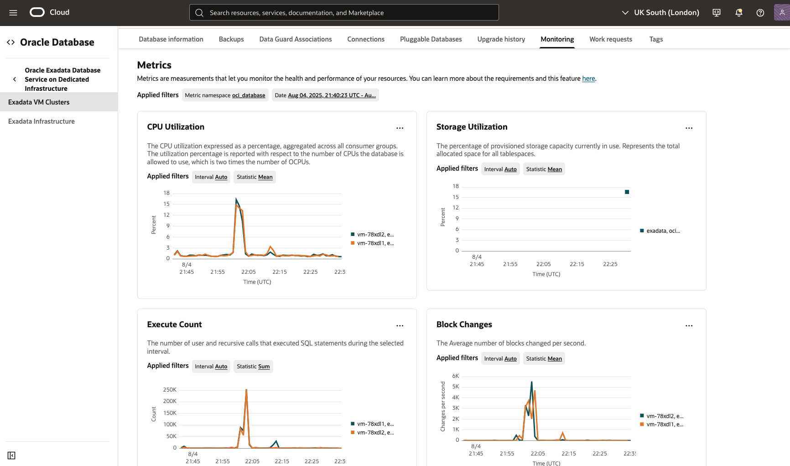

- Click **...** from the metric widget, you can select **View query in Metrics Explorer** to view the metrics in the Metrics Explorer page.

     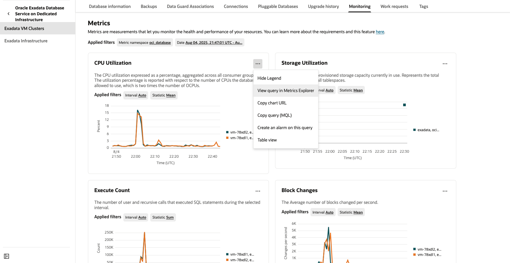

- Page will be redirected to the **OCI Monitoring Service** page, click **Edit Query** to edit the query. In the **Metric name** drop down menu, select the metrics you want to monitor.


     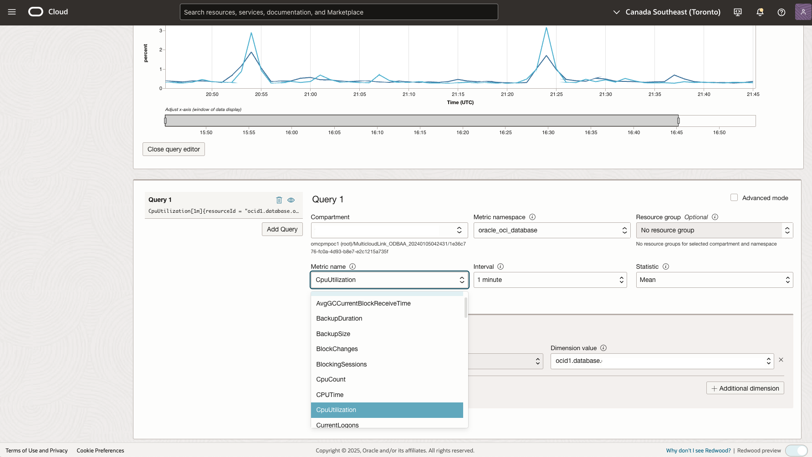

### Check Oracle Database@Azure Monioring metrics in Azure Monitor

- Navigate to the **Oracle Database@Azure Exadata VM Cluster Details** page in Azure Portal
- Click the **Metrics** link under **Monitoring** section, you can see the metrics in Azure Monitor with the Scope set to the Oracle Database@Azure Exadata Infrastructure, Metrics Namespace set to **Oracle Exadata VM Cluster standard metrics**.
- Select the metric from the **Metric** drop down menu, for example **CPU Utilization**, Aggregation set to **Average**.

     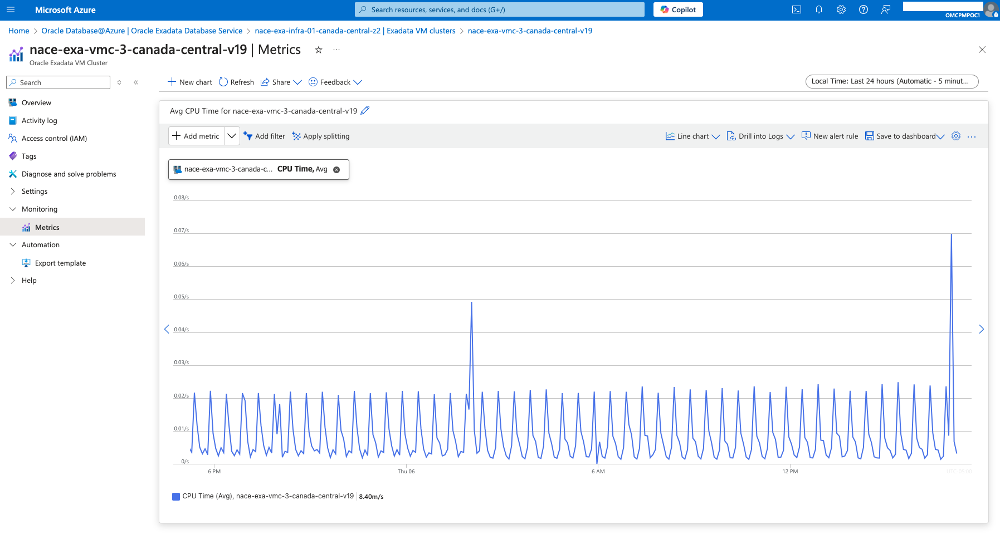

- Metric Splitting can be applied to the metric, multiple **Split by** values can be selected from the **Values** drop down menu, for example **Oracle resource name** and **Oracle resource type**.

     

- You can also add second metric to overlay on the first metric, for example **DB Time**.

     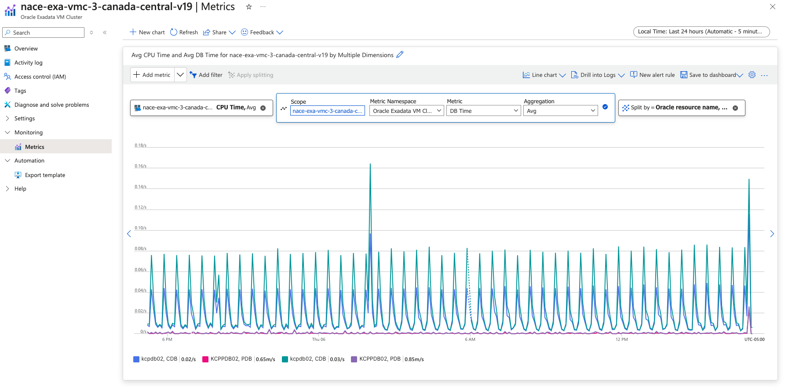

*Note*: CDB and PDB level metrics from metrics namespace **oracle\_oci\_database** are only available in Azure Monitor when **OCI Database Management Service** is enabled for Oracle Database@Azure.


## Conclusion

In this lab, you learned the steps to enable **OCI Database Management Service** for **Oracle Database@Azure** to monitor the key performance and configuration metrics of the fleet of **Oracle Database@Azure** cloud databases. In addition, all the database performance and management tools such as **Performance Hub** and **AWR Explorer** are at your finger tips to support DBAs for their day to day database operations. 

## Acknowledgements

- **Author** - Royce Fu, Master Principal Cloud Architect, North America Cloud Infrastructure Engineering
- **Contributors** - Royce Fu, Derik Harlow, Murtaza Husain, Sriram Vrinda
- **Last Updated By/Date** - Royce Fu, July 2025
